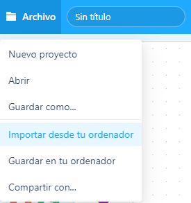
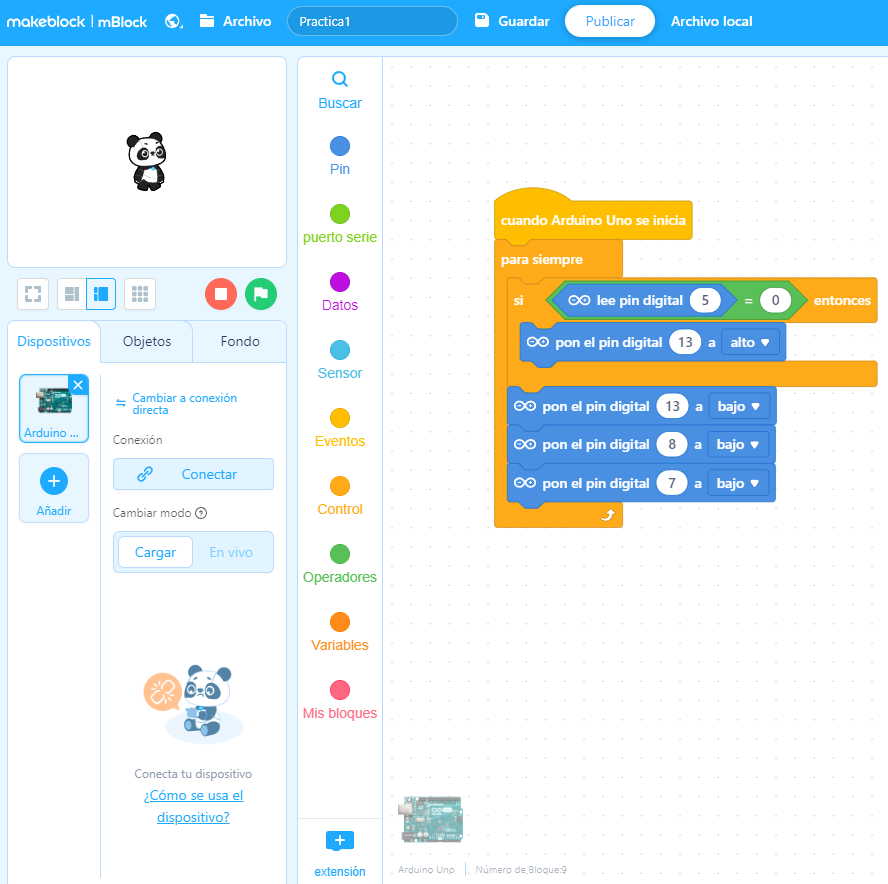

# UNIT Maker Block – 14 Video Tutoriales

El UNIT Maker Block es un kit de electrónica y programación con una serie de con 14 vídeos de prácticas, retos y juegos enfocados en enseñar a niños y jóvenes a programar en el lenguaje Scratch, también conocido como programación en bloques, utilizando el entorno del programa mBlock el cual está enfocado en este tipo de programación, sin embargo también es compatible con otros lenguajes de programación como C++.

## CONTENIDO
+ [Videos](#videos)
+ [¿Cómo importar códigos mBlock?](#importar-códigos-mblock)
+ [Código mBlock](#códigos-mblock)
+ [Imágenes mBlock](#imágenes-mblock)

## VIDEOS
### 1. [Introducción a mBlocks](https://www.youtube.com/watch?v=74nqwhBRfZI)
### 2. Manejo de Leds y botones
+ [**Práctica 1: Encendido de un led con Botón**](https://www.youtube.com/watch?v=6zPMTc8hTLI)
+ [**Práctica 2: Encendido de led con espera de 3 segundos**](https://www.youtube.com/watch?v=hG1D5UIZLZk)
+ [**Reto 1: Encendido de Leds con cada botón**](https://www.youtube.com/watch?v=bC80JY4wKTA)
### 3. Manejo del buzzer
+ [**Practica 3: Encendido de buzzer con un botón**](https://www.youtube.com/watch?v=MXmN0dQyxnM)
+ [**Reto 2: Activa el buzzer con un botón y haz una secuencia led**](https://www.youtube.com/watch?v=2YCx9HBMaYM)
### 4. Manejo del Servo y Joystick
+ [**Práctica 4: Hacer un saludo con el Servo**](https://www.youtube.com/watch?v=36OPSkszX5Q)
+ [**Práctica 5: Encender LED con el joystick**](https://www.youtube.com/watch?v=Mvc66LN7Ys8)
+ [**Practica 6: Mover el servo con el joystick**](https://www.youtube.com/watch?v=GmGzd6HAclg)
+ [**Reto 3: Mover dos servos juntos con el joystick**](https://www.youtube.com/watch?v=8wyeFHxnvlM)
### 5. Programación de juegos
+ [**Ayudando a Unito**](https://www.youtube.com/watch?v=vonmb0CNppY)
+ [**Electronic Space**](https://www.youtube.com/watch?v=vwVFx28aFfI)
+ [**Juego de Memoria**](https://www.youtube.com/watch?v=6Xoal-BOHaU)
### 6. Ensamble y programación de Brazo
+ [**Brazo Robot**](https://www.youtube.com/watch?v=9DHy2TkKxhw)

## IMPORTAR CÓDIGOS MBLOCK
Para importar los códigos mBlock de tu ordenador a tu cuenta maker block en linea, debes seguir los siguientes pasos:
1. Descarga el archivo .mblock de la práctica, reto o juego que quieras.
2. En el entorno de maker block en línea coloca el cursor sobre `Archivo` y selecciona `Importar desde tu ordenador`.
   
    

3. Selecciona el archivo que deseas importar y da clic en abrir y ¡Listo!
    
    

## CÓDIGOS MBLOCK
### **Practicas**
+ [**Práctica 1: Encendido de un led con Botón**](https://github.com/UNIT-Electronics/Maker-Block-Unit/blob/main/Codigo_MBlocks/Practica1.mblock)
+ [**Práctica 2: Encendido de led con espera de 3 segundos**](https://github.com/UNIT-Electronics/Maker-Block-Unit/blob/main/Codigo_MBlocks/Practica2.mblock)
+ [**Practica 3: Encendido de buzzer con un botón**](https://github.com/UNIT-Electronics/Maker-Block-Unit/blob/main/Codigo_MBlocks/Practica3.mblock)
+ [**Práctica 4: Hacer un saludo con el Servo**](https://github.com/UNIT-Electronics/Maker-Block-Unit/blob/main/Codigo_MBlocks/Practica4.mblock)
+ [**Práctica 5: Encender LED con el joystick**](https://github.com/UNIT-Electronics/Maker-Block-Unit/blob/main/Codigo_MBlocks/Practica5.mblock)
+ [**Practica 6: Mover el servo con el joystick**](https://github.com/UNIT-Electronics/Maker-Block-Unit/blob/main/Codigo_MBlocks/Practica6.mblock)

### **Retos**
+ [**Reto 1: Encendido de Leds con cada botón**](https://github.com/UNIT-Electronics/Maker-Block-Unit/blob/main/Codigo_MBlocks/Reto1.mblock)
+ [**Reto 2: Activa el buzzer con un botón y haz una secuencia led**](https://github.com/UNIT-Electronics/Maker-Block-Unit/blob/main/Codigo_MBlocks/Reto2.mblock)
+ [**Reto 3: Mover dos servos juntos con el joystick**](https://github.com/UNIT-Electronics/Maker-Block-Unit/blob/main/Codigo_MBlocks/Reto3.mblock)

### **Juegos**
+ [**Ayudando a Unito**](https://github.com/UNIT-Electronics/Maker-Block-Unit/blob/main/Codigo_MBlocks/Ayudando%20a%20Unito.mblock)
+ [**Electronic Space**](https://github.com/UNIT-Electronics/Maker-Block-Unit/blob/main/Codigo_MBlocks/Electronic%20Space.mblock)
+ [**Juego de Memoria**](https://github.com/UNIT-Electronics/Maker-Block-Unit/blob/main/Codigo_MBlocks/Juego%20de%20memoria.mblock)

### [**Brazo Robot**](https://github.com/UNIT-Electronics/Maker-Block-Unit/blob/main/Codigo_MBlocks/Brazo%20robot.mblock)

## IMÁGENES MBLOCK
### **Practicas**
+ [**Práctica 1: Encendido de un led con Botón**](https://github.com/UNIT-Electronics/Maker-Block-Unit/blob/main/Imagenes_MBlock/Practica1%20-%20Encendido%20de%20LED%20con%20boton.png)
+ [**Práctica 2: Encendido de led con espera de 3 segundos**](https://github.com/UNIT-Electronics/Maker-Block-Unit/blob/main/Imagenes_MBlock/Practica2%20-%20Encendido%20de%20LED%20con%20espera%20de%203s.png)
+ [**Practica 3: Encendido de buzzer con un botón**](https://github.com/UNIT-Electronics/Maker-Block-Unit/blob/main/Imagenes_MBlock/Practica3%20-%20Encendido%20de%20buzzer%20con%20un%20boton.png)
+ [**Práctica 4: Hacer un saludo con el Servo**](https://github.com/UNIT-Electronics/Maker-Block-Unit/blob/main/Imagenes_MBlock/Pr%C3%A1ctica4%20-%20Hacer%20un%20saludo%20con%20el%20Servo.png)
+ [**Práctica 5: Encender LED con el joystick**](https://github.com/UNIT-Electronics/Maker-Block-Unit/blob/main/Imagenes_MBlock/Pr%C3%A1ctica5%20-%20Encender%20LED%20con%20el%20joystick.png)
+ [**Practica 6: Mover el servo con el joystick**](https://github.com/UNIT-Electronics/Maker-Block-Unit/blob/main/Imagenes_MBlock/Practica6%20-%20Mover%20el%20servo%20con%20el%20joystick.png)

### **Retos**
+ [**Reto 1: Encendido de Leds con cada botón**](https://github.com/UNIT-Electronics/Maker-Block-Unit/blob/main/Imagenes_MBlock/Reto1%20-%20Encendido%20de%20Leds%20con%20cada%20boton.png)
+ [**Reto 2: Activa el buzzer con un botón y haz una secuencia led**](https://github.com/UNIT-Electronics/Maker-Block-Unit/blob/main/Imagenes_MBlock/Reto2%20-%20Activa%20el%20buzzer%20con%20un%20bot%C3%B3n%20y%20haz%20una%20secuencia%20led.png)
+ [**Reto 3: Mover dos servos juntos con el joystick**](https://github.com/UNIT-Electronics/Maker-Block-Unit/blob/main/Imagenes_MBlock/Reto3%20-%20Mover%20dos%20servos%20juntos%20con%20el%20joystick.png)

### **Juegos**
+ [**Ayudando a Unito**](https://github.com/UNIT-Electronics/Maker-Block-Unit/blob/main/Imagenes_MBlock/Ayudando-a-Unito.jpg)
+ [**Electronic Space**](https://github.com/UNIT-Electronics/Maker-Block-Unit/blob/main/Imagenes_MBlock/Electronic-Space.jpg)
+ [**Juego de Memoria**](https://github.com/UNIT-Electronics/Maker-Block-Unit/blob/main/Imagenes_MBlock/Juego%20de%20Memoria.jpg)

### [**Brazo Robot**](https://github.com/UNIT-Electronics/Maker-Block-Unit/blob/main/Imagenes_MBlock/Brazo%20robot.jpg)
